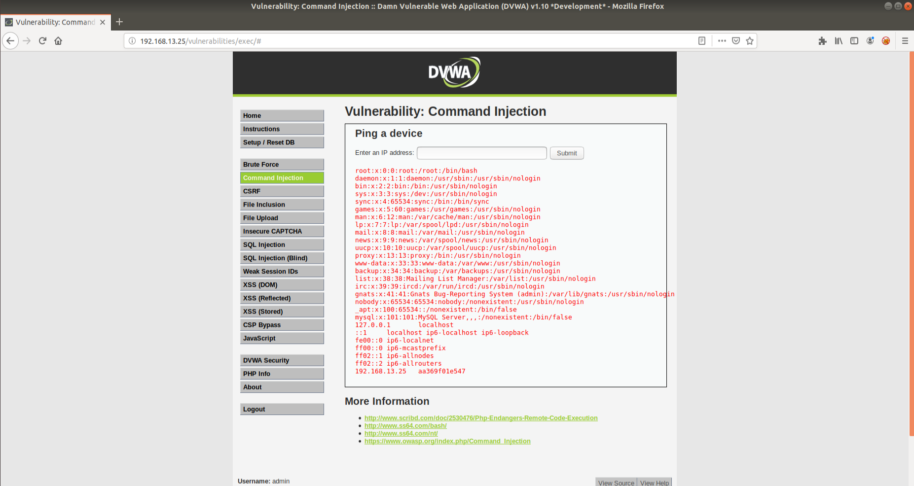
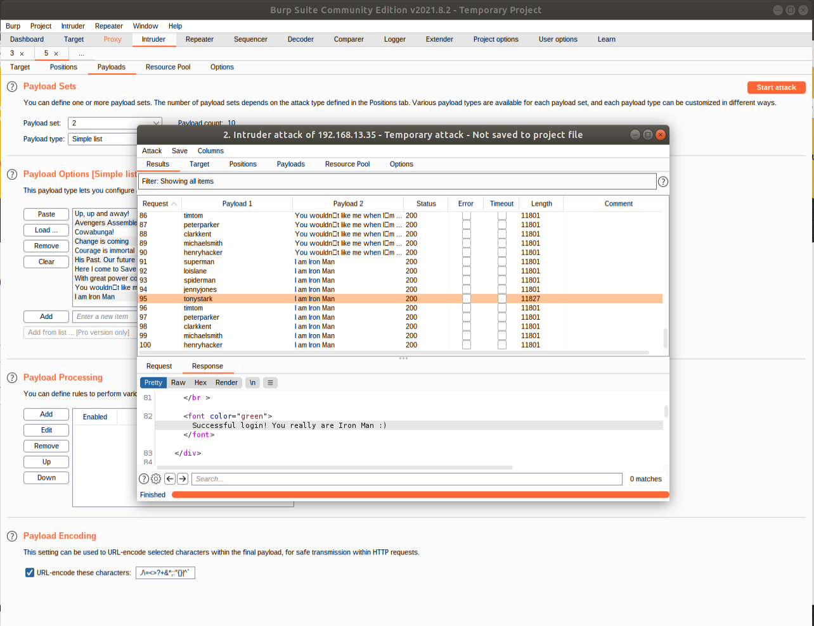
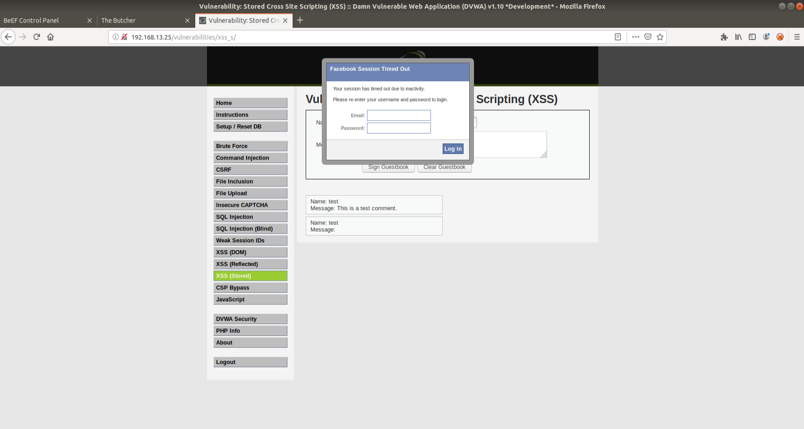
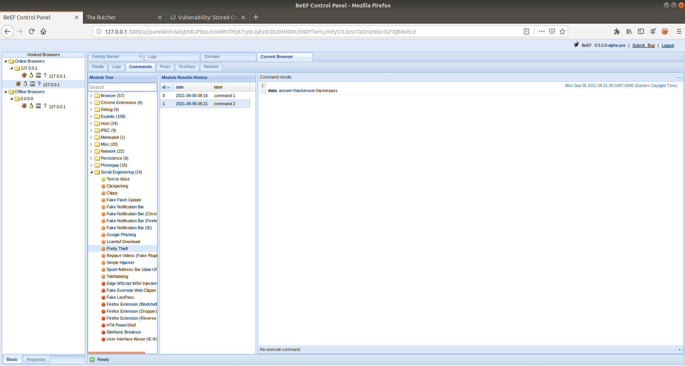

## Web Application 1: Your Wish is My Command Injection

Command run to gain the above information: `; cat ../../../../../etc/passwd && cat ../../../../../etc/hosts`

Recommended mitigation for an OS command injection attack is a combination of blocking OS commands being run within the web application and using platform APIs to enable to desired functionality. Platform APIs that can be used are PHP or JavaScript and even though they come with their own unique security challenges, using one of these will greatly reduce how easy it will be to for an attacker to gain OS level access.

## Web Application 2: A Brute Force to Be Reckoned With

Mitigation stratergies for a bruteforce attack on compromised passwords would be to setup an alert system using the haveibeenpwned.com API. A more highly recommended stratergy would be to implement a lockout for incorrect passwords from the same IP and lock accounts when the specified number of incorrect passwords have been reached, and send an email to the user to alert of this.

## Web Application 3: Where's the BeEF?

This XXS vulnerability can be mitigated by adding in form validation. This would validate that the user isn't trying to enter an XSS script or include any other unintended responses, other than text into the guestbook.
