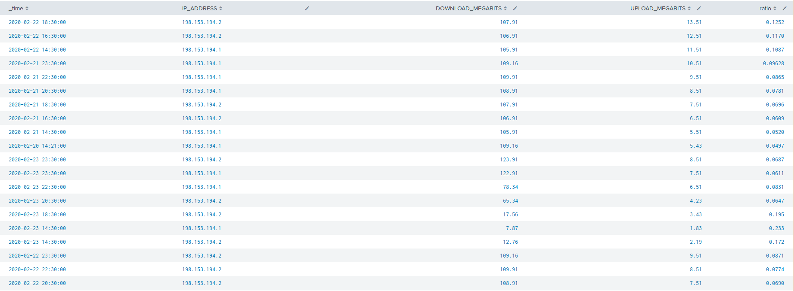
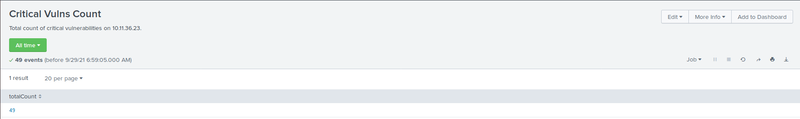
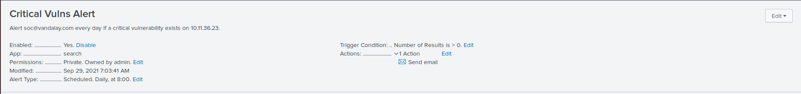
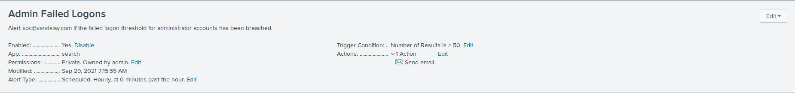

## Step 1: The Need for Speed

Search with eval command: `source="server_speedtest.csv" | eval ratio = 'UPLOAD_MEGABITS' /'DOWNLOAD_MEGABITS'`

Search with eval and table commands: `source="server_speedtest.csv" | eval ratio = 'UPLOAD_MEGABITS' /'DOWNLOAD_MEGABITS' | table _time IP_ADDRESS DOWNLOAD_MEGABITS UPLOAD_MEGABITS ratio`

Approximate date and time of attack: 23/02/2021 14:30:00

Time to recover: 8 hours
   
## Step 2: Are We Vulnerable?

Search for critical vulnerabilities on host 10.11.36.23: `source="nessus_logs.csv" dest_ip="10.11.36.23" severity=critical`

## Step 3: Drawing the (base)line

The bruteforce attack occured on Friday, 21st February @ 9AM - 1PM.

Baseline for normal activity: `35 failed logons in an hour`

Alert threshold: `50 failed logons in an hour`

