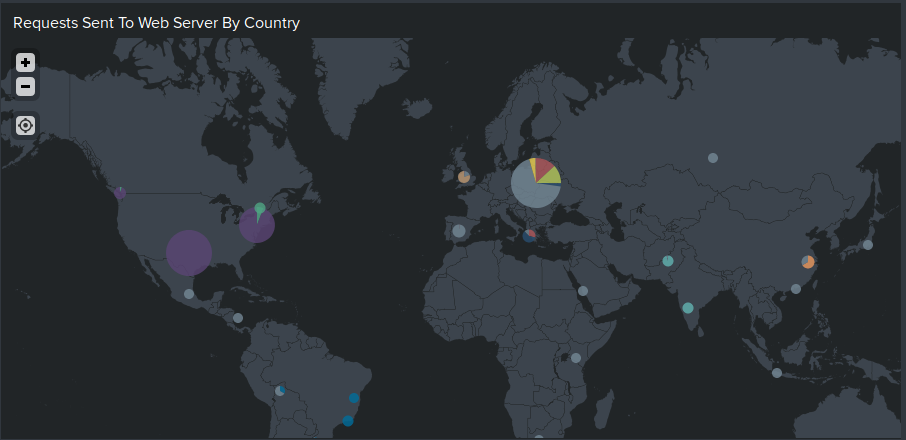

# Protecting VSI from Future Attacks

## Part 1: Windows Server Attack

A global mitigation for these attacks would be to use number strings for user names that don't have a standard increment between user names. This will ensure that the users' login names won't be easily guessable for an attacker and it would also ensure that is an attacker does figure out the increment between 2 users, they won't be able to apply this to the next user name.

A user-level mitigation would be multi-factor authentication utilising the user's password and a soft key. This would ensure that, even if the attacker did know a user's password, or was able tro bruteforce it, they would need to also have access to the user's soft key to be able to authenticate and gain access as that user.

A mitigation for "Bad Logins" would be to blacklist the IP address, if originating from the same IP address, for a specified amount of time. This would ensure that the attacker using that IP address wouldn't be able to flood "Bad Logins" to force user accounts to become locked. An example would be if an attacker generates 3 or more "Bad Logins" for any amount of user accounts, that IP address is then blacklisted from the user login portal, and then un-blacklisted once 24 hours has elapsed. The expiry on the blacklist will be to prevent a legitimate user from being blacklisted if they happen to gain the same IP address that has been previously used by an attacker.

## Part 2: Apache Webserver Attack

The mitigation recommendation for the attacks being received from JobeCorp would be to block all incoming traffic coming from IP addresses that originate from Ukraine, as there was a significant spike of traffic from Ukraine at the time of the attack.

Geographic Map for Incoming Traffic:

Top 10 Countries prior to attack:

Top 10 Countries following attack:

Two other rules to mitigate future attacks would be as follows:
- Limiting login attempts to 10 attempts per minute, if the requests either target the same user or originate from the same IP address, regardless of the region the IP address originates from. This is also known as a "rate limit".
- Blocking any IP address that are sending a suspicious amount of login attempts if the useragent header is "Mozilla/4.0 (compatible; MSIE 6.0; Windows NT 5.2; SV1; .NET CLR 2.0.50727987787; InfoPath.1)". During the attack, this useragent was associated with 1,296 login attempts.
