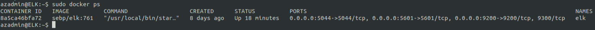

## Automated ELK Stack Deployment

The files in this repository were used to configure the network depicted below.

These files have been tested and used to generate a live ELK deployment on Azure. They can be used to either recreate the entire deployment pictured above. Alternatively, select portions of the yml and config file may be used to install only certain pieces of it, such as Filebeat.

  - _TODO: Enter the playbook file._

This document contains the following details:
- Description of the Topology
- Access Policies
- ELK Configuration
  - Beats in Use
  - Machines Being Monitored
- How to Use the Ansible Build

### Description of the Topology

The main purpose of this network is to expose a load-balanced and monitored instance of DVWA, the D*mn Vulnerable Web Application.

Load balancing ensures that the application will be highly available, in addition to restricting access to the network.
- Load balancers protect the availability of the application deployed within the availability zone. The advantage of a jump box is being able to restrict access and reduce the attack surface of your network.

Integrating an ELK server allows users to easily monitor the vulnerable VMs for changes to the data and system files.
- Filebeat watches for changes to the log files, collects logged events and forwards them onto Logstash.
- Metricbeat records metrics from the operating system and from the services running on the server.

The configuration details of each machine may be found below.

| Name     | Function | IP Address | Operating System |
|----------|----------|------------|------------------|
| Jump-Box-Provisioner | Gateway | 10.0.0.12 / 20.185.38.187  | Linux            |
| Web-1    | Web Server | 10.0.0.8 | Linux            |
| Web-2    | Web Server | 10.0.0.11 | Linux            |
| ELK      | ELK Monitoring | 10.1.0.4 / 20.63.82.93 | Linux            |
| Load Balancer | Load Balancer | 168.62.61.169 | Linux |
| Home Workstation | Access to Network | Public IP | Linux |

### Access Policies

The machines on the internal network are not exposed to the public Internet. 

Only the jump box machine can accept connections from the Internet. Access to this machine is only allowed from the following IP addresses:
- Home Workstation with public IP address.

Machines within the network can only be accessed by Jump-Box-Provisioner machine via SSH.
- Jump-Box-Provisioner: 10.0.0.12
- Home Workstation: Public IP

A summary of the access policies in place can be found in the table below.

| Name     | Publicly Accessible | Allowed IP Addresses |
|----------|---------------------|----------------------|
| Jump Box | No | Home Workstation Public IP via SSH |
| Web-1 | No | 10.0.0.12 via SSH |
| Web-2 | No | 10.0.0.12 via SSH |
| ELK | No | 10.0.0.12 via SSH & Home Workstation Public IP via TCP |
| Load Balancer | No | Home Workstation Public IP via HTTP |

### Elk Configuration

Ansible was used to automate configuration of the ELK machine. No configuration was performed manually, which is advantageous because...
- This allows the easy deployment and configuration of additional ELK machines in the future, while keeping all configuration consistent.

The playbook implements the following tasks:
- Install Docker.
- Install python3-pip.
- Install the Python Docker module.
- Increase system memory.
- Allowing the following ports to be exposed so the ELK container can utilise them:
  - 9200:9200
  - 5601:5601
  - 5044:5044
- Ensuring the Docker service is enabled and remains persistent through system restarts.

The following screenshot displays the result of running `docker ps` after successfully configuring the ELK instance.

### Target Machines & Beats
This ELK server is configured to monitor the following machines:
- Web-1: 10.0.0.8
- Web-2: 10.0.0.11

We have installed the following Beats on these machines:
- Filebeat
- Metricbeat

These Beats allow us to collect the following information from each machine:
- _TODO: In 1-2 sentences, explain what kind of data each beat collects, and provide 1 example of what you expect to see. E.g., `Winlogbeat` collects Windows logs, which we use to track user logon events, etc._
- Filebeat allows us to collect logs from each machine and passes them to Elasticsearch or Logstash so that they are indexed and easily searchable (eg: all logs in /etc/logs/ from each machine). Metricbeat allows us to collect metrics from each machine so we are able to track the health of the machines in a centralised location. These metrics include uptime, CPU usage, RAM usage, etc.

### Using the Playbook
In order to use the playbook, you will need to have an Ansible control node already configured. Assuming you have such a control node provisioned: 

SSH into the control node and follow the steps below:
- Copy the beat config file to /etc/ansible/roles.
- Update the beat config file to include the private IP address and port of the ELK machine, username and password for both Elasticsearch and Kibana ont he ELK machine.
- Run the playbook, and navigate to the ELK public IP (20.63.82.93 in this case) to check that the installation worked as expected.
